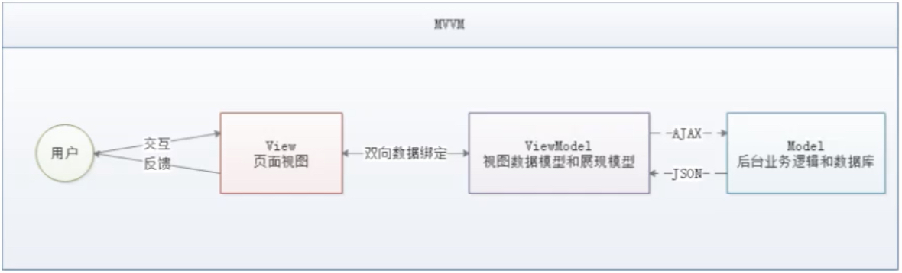
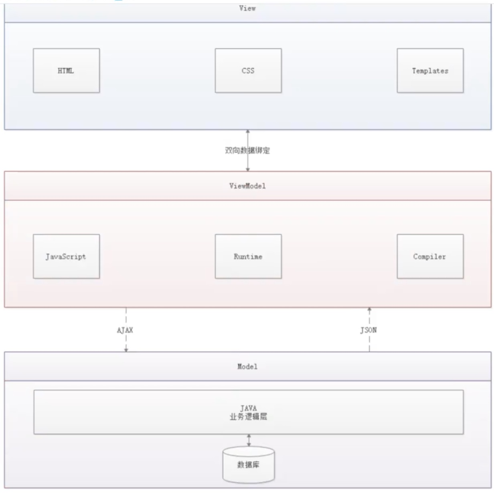

# Vue学习
### MVVM模式

- 什么是MVVM？ - MVVM（Model-View-ViewModel）是一种软件架构设计模式，由微软WPF（用于替代WinForm，以前就是这个技术开发桌面应用程序的）
和Silverlight（类似于Java Applet，简单点说就是在浏览器上运行的WPF）的架构师Ken Cooper和Ted Peters开发，是一种简化用户界面的
**事件驱动编程方式**。由John Gossman（同样也是WPF和Silverlight的架构师）于2005年在他的博客上发表。
- MVVM源自于经典的MVC（Model-View-Controller）模式。MVVM的核心是**ViewModel**层，负责转换Model中的数据对象来让数据变得更容易管理和使用，其作用如下：
    - ModelView层向上与View层进行双向数据绑定
    - ModelView层向下与Model层通过接口请求进行数据交互

PS: Vue不改变DOM元素，双向绑定，前端View数据改动可以通过ViewModel直接反应传递到后端Model，反之亦然。操作DOM影响性能。

MVVM已经相当成熟了，主要运用但不仅仅在网络应用程序开发中。丹霞流行但MVVM框架有Vue.js，AngularJS等
- 为什么要使用MVVM
    - MVVM模式和MVC模式一样，主要目的是分离视图（View）和模型（Model），关注点分离（Separation of concerns，SOC），有以下几大好处：
        - 低耦合：视图（View）可以独立于Model变化和修改，一个ViewModel可以绑定到不同等View上，当View变化当时候Model可以不变，当Model变化的时候View也可以不变。
        - 可复用：你可以把一些视图逻辑放在一个ViewModel里面，让很多View崇勇这段视图逻辑。
        - 独立开发：前端UI开发人员可以专注于业务逻辑和数据的开发（ViewModel），UI设计人员可以专注于页面设计。
        - 可测试：界面速来比较难于测试的，二现在测试可以针对ViewModel来写。
- MVVM的组成部分


#### View
**View**是视图层，也就是用户界面。前端主要由*HTML*和*CSS*来构建，为了更方便地展现*ViewModel*或者*Model*层的数据，已经产生了各种各样的前后端模板语言，
比如FreeMarker、Thymeleaf等等，各大MVVM框架入Vue.js, AngularJS, EJS等也都有自己用来构建用户界面等内置模板语言。
#### Model
**Model**是数据模型，泛指后端进行各种业务逻辑处理和数据操控，主要围绕数据库系统展开。这里等难点主要在于需要和前端约定统一的*接口规则*。
#### ViewModel
**ViewModel**是由前端开发人员组织生成和维护的视图数据层。在这一层，前端开发者对从后端获取的Model数据进行转换处理，做二次封装，以生成符合View层使用预期的视图数据模型。

需要注意的是ViewModel所封装出来的数据模型包括视图的**状态**和**行为**两部分，而Model层的数据模型只包含状态的！
- ViewModel状态：比如页面的这一块展示什么，哪一块展示什么，这些都数据视图状态（展示）
- ViewModel行为：页面加载进来时发生什么，点击这一块发生什么，这一块滚动时发生什么，这些都数据视图行为（交互）

视图状态和行为都封装在了ViewModel里。这样的封装使得ViewModel可以完整地去描述View层。由于实现了双向绑定，ViewModel的内容会实时展示在View层，
这是激动人心的，因为后端开发者再也不必低效又麻烦地通过操纵DOM去更新视图。

MVVM框架已经把最脏最累的一块做好了，我们开发者只需要处理和维护ViewModel，更新数据视图就会自动得到相应更新，真正实现**事件驱动编程**。

View层展现的不是Model层的数据，而是ViewModel的数据，由ViewModel负责与Model层交互，这就完全解耦来View层和Model层，这个解耦是至关重要的，
它是前后端分离方案实施的重要一环。

---
### Vue
Vue是一套用于构建用户界面的渐进式框架，发布于2014年2月。与其它大型框架不同的是，Vue被设计为可以自底向上逐层应用。Vue的核心库只关注视图层，不仅
易于上手，还便于与第三方库（如：vue-router，vue-resource，vuex）或既有项目整合。
#### MVVM模式的实现者
- Model：模型层，在这里表示JavaScript对象
- View：视图层，在这里表示DOM（HTML操作的元素）
- ViewModel：连接视图和数据的中间件，Vue.js就是MVVM中的ViewModel层的实现者

    在MVVM架构中，是不允许数据和视图直接通信的，只能通过ViewModel来通信，而ViewModel就是定义了一个Observer观察者
- ViewModel能够观察到数据的变化，并对视图对应的内容进行更新。
- ViewModel能够监听到视图的变化，并能够通知数据发生改变。

    至此，我们就明白了，Vue.js就是一个MVVM的实现者，她的核心就是实现了DOM舰艇与数据绑定。
#### 为什么要使用Vue.js
- 轻量级，体积小是一个重要指标。Vue.js压缩后只有20多kb（Angular压缩后56kb+，React压缩后44kb+）
- 移动优先。更适合移动端，比如移动端的Touch事件
- 易上手，学习曲线平稳，文档齐全
- 洗去了Angular（模块化）和React（虚拟DOM）的长处，并拥有自己独特的功能，如：计算属性
- 开源，社区活跃度高
- ...

---
### 第一个Vue程序
使用intellij插件：https://plugins.jetbrains.com/plugin/9442-vue-js

#### 下载地址

开发版本
- 包含完整的警告和调试模式：https://vuejs.org/js/vue.js
- 删除了警告，30.96KB min + gzip: https://vuejs.org/js/vue.min.js
    
CDN
```xml
<script src="https://cdn.jsdelivr.net/npm/vue@2.6.14/dist/vue.js"></script>
<script src="https://cdn.jsdelivr.net/npm/vue@2.6.14/dist/vue.min.js"></script>
```` 

#### 代码编写
Vue.js的核心是实现了MVVM模式，她扮演的角色就是ViewModel层，那么所谓的第一个应用程序就是展示她的数据绑定功能，操作流程如下：
1. 创建一个HTML文件demo1.html并测试
2. 引入Vue.js
3. 引入一个Vue的实例
4. 将数据绑定到页面元素

#### 测试
1. 浏览器打开HTML文件
2. 开发者工具Console中输入testvm.message = "update message"，回车后查看页面内容更新成"update message"

由此就可以在控制台来直接修改值，中间是可以省略data的，在这个操作中，我并没有主动操作DOM，就让页面的内容发生了变化，这就是接住了Vue的数据绑定功能
实现的；MVVM模式中要求ViewModel层就是使用观察者模式来实现数据的监听与绑定，以做到数据与视图的快速相应。

---
### v-bind （数据绑定）
参考: [v-bind 官方文档](https://cn.vuejs.org/v2/api/#v-bind)

我们已经成功创建了第一个Vue应用！开起来这跟渲染一个字符串模板非常类似，但是Vue在背后做了大量工作。现在数据和DOM已经被建立了关联，所有东西都是响应式的。
我们在控制台操作对象属性，界面可以实时更新！

我们还可以使用**v-bind**来绑定元素特性！

你看到的v-bind等被称为指令。指令带有前缀v-，以表示它们是Vue提供的特殊特性。可能你已经猜到了，它们会在渲染的DOM上应用特殊的响应式行为。在这里，
指令的意思是："将这个元素节点的title特性和Vue实例的message属性保持一致"。

如果你再次打开浏览器的控制台，输入app.message="update"，就会再一次看到这个绑定了title特性的HTML已经进行了更新。

---
### v-if, v-else, v-else-if （判断）
参考: [v-if 官方文档](https://cn.vuejs.org/v2/api/#v-if)

Vue的条件判断语句v-if，v-else。

---
### v-for （循环）
参考: [v-for 官方文档](https://cn.vuejs.org/v2/api/#v-for)

Vue的循环语句

---
### v-on （事件）
参考: [v-on 官方文档](https://cn.vuejs.org/v2/api/#v-on)

Vue的事件，v-on语句可以监听DOM事件，并在触发时运行一些JavaScript代码。

事件有Vue的事件，和前端页面本身的一些事件！我们这里的click是Vue事件，可以绑定到Vue的methods中的方法事件！

---
### Vue：表单双绑、组件 （双向绑定）
#### 什么事双向数据绑定？
Vue.js是一个MVVM框架，即数据双向绑定，即数据变化的时候，视图也就发生变化，当视图发生变化的时候，数据也会跟着同步变化。这也算是Vue.js的精髓之处了。

值得注意的是，我们所说的数据双向绑定，一定是对于UI控件来说的，非UI控件不会涉及到数据双向绑定。

单向数据绑定是使用状态管理工具的前提。如果我们使用**vuex**，那么数据流也是单向的，这时就会和双向数据绑定有冲突。

#### 为什么要实现数据的双向绑定？
在Vue.js中，如果使用**vuex**，实际上数据还是单向的，之所以说是双向绑定，这是用的UI控件来说的，对于我们处理表单，Vue.js的双向数据绑定用起来就特别舒服了。
即两者并不互斥，在全局性数据流使用单向，方便跟踪；局部性数据流使用双向，简单易操作。

#### 在表单中使用双向数据绑定
参考: [v-model 官方文档](https://cn.vuejs.org/v2/api/#v-model)
```
你可以用**v-model**指令在表单<input>、<textarea>及<select>元素上创建双向数据绑定。它会根据空间类型自动选取正确的方法来更新元素。尽管有些神奇，
但v-model本质上不过是语法糖。它负责监听用户输入事件以更新数据，并对一些极端场景进行一些特殊处理。

注意：v-model会忽略所有表单元素但value、checked、selected特性但初始值而总是将Vue实例的数据作为数据来源。你应该通过JavaScript在组件但data选项中声明初始值！
```

---
### Vue组件 （组件）
#### 什么是组件
组件是可服用的vue实例，说白了就是一组可以重复使用的模板，跟JSTL的自定义标签、Thymeleaf的th:fragment等框架有着异曲同工之妙。通常一个应用会以一颗
嵌套的组件树的形式来组织。

#### 第一个Vue组件
参考：[Vue.Component 官方文档](https://cn.vuejs.org/v2/guide/components.html)

注意：在实际开发中，我们并不会用以下方式开发组件，而是采用vue-cli创建.vue模板文件的方式开发，以下方法是为了让大家理解什么是组件。

说明：
- Vue.component()：注册组件
- my-component-li：自定义组件的名字
- template：组件的模板

---
### Vue: Axios异步通信 （网络通信）
#### 什么是Axios
Axios是一个开源的可以用在不同浏览器端和node.js的异步通信框架，她的主要作用就是实现AJAX异步通信，其功能特点如下：
- 从浏览器中创建XMLHttpRequests
- 从node.js创建http请求
- 支持Promise API【JS中链式编程】
- 拦截请求和响应
- 转换请求数据和响应数据
- 取消请求
- 自动转换JSON数据
- 客户端支持防御XSRF（跨站请求伪造）

参考：[axios官网](https://axios-http.com/zh/docs/intro), [axios源代码](https://github.com/axios/axios)

#### 为什么要使用Axios
由于Vue.js是一个视图层框架并且作者（尤雨溪）严格遵守SoC（关注度分离原则），所以Vue.js并不包含AJAX的通信功能，为了解决通信问题，作者单独开发了一
个名为vue-resource的插件，不过在进入2.0版本以后停止了对该插件的维护并推荐来Axios框架。少用jQuery，因为jQuery操作DOM太频繁！

#### 第一个Axios应用程序
咱们开发的接口大部分都是采用JSON格式，可以先在项目里模拟一段JSON数据，数据内容如下：创建一个名为data.json的文件并填入下面的内容，放在项目的根目录下
```json
{
  "name": "狂神说Java",
  "url": "https://blog.kuangstudy.com",
  "page": 1,
  "isNonProfit": true,
  "address": {
    "street": "含光门",
    "city": "陕西西安",
    "country": "中国"
  },
  "links": [
    {
      "name": "bilibili",
      "url": "https://space.bilibili.com/95256449"
    },
    {
      "name": "博客",
      "url": "https://blog.kuangstudy.com"
    },
    {
      "name": "百度",
      "url": "https://www.baidu.com/"
    }
  ]
}
```

html说明：

1. 在这里使用了v-bind将a:href的属性值与Vue实例中的数据进行绑定
2. 使用axios框架的get方法请求AJAX并自动将数据封装进了Vue实例的数据对象中
3. 我们在data中的数据结构必须和Ajax响应回来的数据格式匹配！

---
### Vue的生命周期
参考：[Vue生命周期官网文档](https://cn.vuejs.org/v2/guide/instance.html#%E7%94%9F%E5%91%BD%E5%91%A8%E6%9C%9F%E5%9B%BE%E7%A4%BA)

Vue实例有一个完整的生命周期，也就是从开始创建、初始化数据、编译模板、挂载DOM、渲染->更新->渲染、卸载等一系列过程，我们称这是Vue的生命周期。通俗说
就是Vue实例从创建到销毁的过程，就是生命周期。

在Vue的整个生命周期中，它提供了一系列的事件，可以让我们在事件触发时注册JS方法，可以让我们自己注册的JS方法控制整个大局，在这些事件响应方法中的this
直接指向的是Vue的实例。
