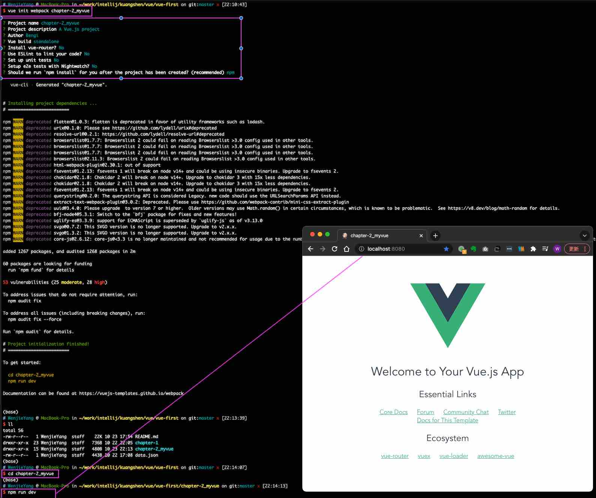

# Vue学习
## Chapter-1
### MVVM模式

- 什么是MVVM？ - MVVM（Model-View-ViewModel）是一种软件架构设计模式，由微软WPF（用于替代WinForm，以前就是这个技术开发桌面应用程序的）
和Silverlight（类似于Java Applet，简单点说就是在浏览器上运行的WPF）的架构师Ken Cooper和Ted Peters开发，是一种简化用户界面的
**事件驱动编程方式**。由John Gossman（同样也是WPF和Silverlight的架构师）于2005年在他的博客上发表。
- MVVM源自于经典的MVC（Model-View-Controller）模式。MVVM的核心是**ViewModel**层，负责转换Model中的数据对象来让数据变得更容易管理和使用，其作用如下：
    - ModelView层向上与View层进行双向数据绑定
    - ModelView层向下与Model层通过接口请求进行数据交互

PS: Vue不改变DOM元素，双向绑定，前端View数据改动可以通过ViewModel直接反应传递到后端Model，反之亦然。操作DOM影响性能。

MVVM已经相当成熟了，主要运用但不仅仅在网络应用程序开发中。丹霞流行但MVVM框架有Vue.js，AngularJS等
- 为什么要使用MVVM
    - MVVM模式和MVC模式一样，主要目的是分离视图（View）和模型（Model），关注点分离（Separation of concerns，SOC），有以下几大好处：
        - 低耦合：视图（View）可以独立于Model变化和修改，一个ViewModel可以绑定到不同等View上，当View变化当时候Model可以不变，当Model变化的时候View也可以不变。
        - 可复用：你可以把一些视图逻辑放在一个ViewModel里面，让很多View崇勇这段视图逻辑。
        - 独立开发：前端UI开发人员可以专注于业务逻辑和数据的开发（ViewModel），UI设计人员可以专注于页面设计。
        - 可测试：界面速来比较难于测试的，二现在测试可以针对ViewModel来写。
- MVVM的组成部分


#### View
**View**是视图层，也就是用户界面。前端主要由*HTML*和*CSS*来构建，为了更方便地展现*ViewModel*或者*Model*层的数据，已经产生了各种各样的前后端模板语言，
比如FreeMarker、Thymeleaf等等，各大MVVM框架入Vue.js, AngularJS, EJS等也都有自己用来构建用户界面等内置模板语言。
#### Model
**Model**是数据模型，泛指后端进行各种业务逻辑处理和数据操控，主要围绕数据库系统展开。这里等难点主要在于需要和前端约定统一的*接口规则*。
#### ViewModel
**ViewModel**是由前端开发人员组织生成和维护的视图数据层。在这一层，前端开发者对从后端获取的Model数据进行转换处理，做二次封装，以生成符合View层使用预期的视图数据模型。

需要注意的是ViewModel所封装出来的数据模型包括视图的**状态**和**行为**两部分，而Model层的数据模型只包含状态的！
- ViewModel状态：比如页面的这一块展示什么，哪一块展示什么，这些都数据视图状态（展示）
- ViewModel行为：页面加载进来时发生什么，点击这一块发生什么，这一块滚动时发生什么，这些都数据视图行为（交互）

视图状态和行为都封装在了ViewModel里。这样的封装使得ViewModel可以完整地去描述View层。由于实现了双向绑定，ViewModel的内容会实时展示在View层，
这是激动人心的，因为后端开发者再也不必低效又麻烦地通过操纵DOM去更新视图。

MVVM框架已经把最脏最累的一块做好了，我们开发者只需要处理和维护ViewModel，更新数据视图就会自动得到相应更新，真正实现**事件驱动编程**。

View层展现的不是Model层的数据，而是ViewModel的数据，由ViewModel负责与Model层交互，这就完全解耦来View层和Model层，这个解耦是至关重要的，
它是前后端分离方案实施的重要一环。

---
### Vue
Vue是一套用于构建用户界面的渐进式框架，发布于2014年2月。与其它大型框架不同的是，Vue被设计为可以自底向上逐层应用。Vue的核心库只关注视图层，不仅
易于上手，还便于与第三方库（如：vue-router，vue-resource，vuex）或既有项目整合。
#### MVVM模式的实现者
- Model：模型层，在这里表示JavaScript对象
- View：视图层，在这里表示DOM（HTML操作的元素）
- ViewModel：连接视图和数据的中间件，Vue.js就是MVVM中的ViewModel层的实现者

    在MVVM架构中，是不允许数据和视图直接通信的，只能通过ViewModel来通信，而ViewModel就是定义了一个Observer观察者
- ViewModel能够观察到数据的变化，并对视图对应的内容进行更新。
- ViewModel能够监听到视图的变化，并能够通知数据发生改变。

    至此，我们就明白了，Vue.js就是一个MVVM的实现者，她的核心就是实现了DOM舰艇与数据绑定。
#### 为什么要使用Vue.js
- 轻量级，体积小是一个重要指标。Vue.js压缩后只有20多kb（Angular压缩后56kb+，React压缩后44kb+）
- 移动优先。更适合移动端，比如移动端的Touch事件
- 易上手，学习曲线平稳，文档齐全
- 洗去了Angular（模块化）和React（虚拟DOM）的长处，并拥有自己独特的功能，如：计算属性
- 开源，社区活跃度高
- ...

---
### 第一个Vue程序
使用intellij插件：https://plugins.jetbrains.com/plugin/9442-vue-js

#### 下载地址

开发版本
- 包含完整的警告和调试模式：https://vuejs.org/js/vue.js
- 删除了警告，30.96KB min + gzip: https://vuejs.org/js/vue.min.js
    
CDN
```xml
<script src="https://cdn.jsdelivr.net/npm/vue@2.6.14/dist/vue.js"></script>
<script src="https://cdn.jsdelivr.net/npm/vue@2.6.14/dist/vue.min.js"></script>
```` 

#### 代码编写
Vue.js的核心是实现了MVVM模式，她扮演的角色就是ViewModel层，那么所谓的第一个应用程序就是展示她的数据绑定功能，操作流程如下：
1. 创建一个HTML文件demo1.html并测试
2. 引入Vue.js
3. 引入一个Vue的实例
4. 将数据绑定到页面元素

#### 测试
1. 浏览器打开HTML文件
2. 开发者工具Console中输入testvm.message = "update message"，回车后查看页面内容更新成"update message"

由此就可以在控制台来直接修改值，中间是可以省略data的，在这个操作中，我并没有主动操作DOM，就让页面的内容发生了变化，这就是接住了Vue的数据绑定功能
实现的；MVVM模式中要求ViewModel层就是使用观察者模式来实现数据的监听与绑定，以做到数据与视图的快速相应。

---
### v-bind （数据绑定）
参考: [v-bind 官方文档](https://cn.vuejs.org/v2/api/#v-bind)

我们已经成功创建了第一个Vue应用！开起来这跟渲染一个字符串模板非常类似，但是Vue在背后做了大量工作。现在数据和DOM已经被建立了关联，所有东西都是响应式的。
我们在控制台操作对象属性，界面可以实时更新！

我们还可以使用**v-bind**来绑定元素特性！

你看到的v-bind等被称为指令。指令带有前缀v-，以表示它们是Vue提供的特殊特性。可能你已经猜到了，它们会在渲染的DOM上应用特殊的响应式行为。在这里，
指令的意思是："将这个元素节点的title特性和Vue实例的message属性保持一致"。

如果你再次打开浏览器的控制台，输入app.message="update"，就会再一次看到这个绑定了title特性的HTML已经进行了更新。

---
### v-if, v-else, v-else-if （判断）
参考: [v-if 官方文档](https://cn.vuejs.org/v2/api/#v-if)

Vue的条件判断语句v-if，v-else。

---
### v-for （循环）
参考: [v-for 官方文档](https://cn.vuejs.org/v2/api/#v-for)

Vue的循环语句

---
### v-on （事件）
参考: [v-on 官方文档](https://cn.vuejs.org/v2/api/#v-on)

Vue的事件，v-on语句可以监听DOM事件，并在触发时运行一些JavaScript代码。

事件有Vue的事件，和前端页面本身的一些事件！我们这里的click是Vue事件，可以绑定到Vue的methods中的方法事件！

---
### Vue：表单双绑、组件 （双向绑定）
#### 什么事双向数据绑定？
Vue.js是一个MVVM框架，即数据双向绑定，即数据变化的时候，视图也就发生变化，当视图发生变化的时候，数据也会跟着同步变化。这也算是Vue.js的精髓之处了。

值得注意的是，我们所说的数据双向绑定，一定是对于UI控件来说的，非UI控件不会涉及到数据双向绑定。

单向数据绑定是使用状态管理工具的前提。如果我们使用**vuex**，那么数据流也是单向的，这时就会和双向数据绑定有冲突。

#### 为什么要实现数据的双向绑定？
在Vue.js中，如果使用**vuex**，实际上数据还是单向的，之所以说是双向绑定，这是用的UI控件来说的，对于我们处理表单，Vue.js的双向数据绑定用起来就特别舒服了。
即两者并不互斥，在全局性数据流使用单向，方便跟踪；局部性数据流使用双向，简单易操作。

#### 在表单中使用双向数据绑定
参考: [v-model 官方文档](https://cn.vuejs.org/v2/api/#v-model)
```
你可以用**v-model**指令在表单<input>、<textarea>及<select>元素上创建双向数据绑定。它会根据空间类型自动选取正确的方法来更新元素。尽管有些神奇，
但v-model本质上不过是语法糖。它负责监听用户输入事件以更新数据，并对一些极端场景进行一些特殊处理。

注意：v-model会忽略所有表单元素但value、checked、selected特性但初始值而总是将Vue实例的数据作为数据来源。你应该通过JavaScript在组件但data选项中声明初始值！
```

---
### Vue组件 （组件）
#### 什么是组件
组件是可服用的vue实例，说白了就是一组可以重复使用的模板，跟JSTL的自定义标签、Thymeleaf的th:fragment等框架有着异曲同工之妙。通常一个应用会以一颗
嵌套的组件树的形式来组织。

#### 第一个Vue组件
参考：[Vue.Component 官方文档](https://cn.vuejs.org/v2/guide/components.html)

注意：在实际开发中，我们并不会用以下方式开发组件，而是采用vue-cli创建.vue模板文件的方式开发，以下方法是为了让大家理解什么是组件。

说明：
- Vue.component()：注册组件
- my-component-li：自定义组件的名字
- template：组件的模板

---
### Vue: Axios异步通信 （网络通信）
#### 什么是Axios
Axios是一个开源的可以用在不同浏览器端和node.js的异步通信框架，她的主要作用就是实现AJAX异步通信，其功能特点如下：
- 从浏览器中创建XMLHttpRequests
- 从node.js创建http请求
- 支持Promise API【JS中链式编程】
- 拦截请求和响应
- 转换请求数据和响应数据
- 取消请求
- 自动转换JSON数据
- 客户端支持防御XSRF（跨站请求伪造）

参考：[axios官网](https://axios-http.com/zh/docs/intro), [axios源代码](https://github.com/axios/axios)

#### 为什么要使用Axios
由于Vue.js是一个视图层框架并且作者（尤雨溪）严格遵守SoC（关注度分离原则），所以Vue.js并不包含AJAX的通信功能，为了解决通信问题，作者单独开发了一
个名为vue-resource的插件，不过在进入2.0版本以后停止了对该插件的维护并推荐来Axios框架。少用jQuery，因为jQuery操作DOM太频繁！

#### 第一个Axios应用程序
咱们开发的接口大部分都是采用JSON格式，可以先在项目里模拟一段JSON数据，数据内容如下：创建一个名为data.json的文件并填入下面的内容，放在项目的根目录下
```json
{
  "name": "狂神说Java",
  "url": "https://blog.kuangstudy.com",
  "page": 1,
  "isNonProfit": true,
  "address": {
    "street": "含光门",
    "city": "陕西西安",
    "country": "中国"
  },
  "links": [
    {
      "name": "bilibili",
      "url": "https://space.bilibili.com/95256449"
    },
    {
      "name": "博客",
      "url": "https://blog.kuangstudy.com"
    },
    {
      "name": "百度",
      "url": "https://www.baidu.com/"
    }
  ]
}
```

html说明：

1. 在这里使用了v-bind将a:href的属性值与Vue实例中的数据进行绑定
2. 使用axios框架的get方法请求AJAX并自动将数据封装进了Vue实例的数据对象中
3. 我们在data中的数据结构必须和Ajax响应回来的数据格式匹配！

---
### Vue的生命周期
参考：[Vue生命周期官网文档](https://cn.vuejs.org/v2/guide/instance.html#%E7%94%9F%E5%91%BD%E5%91%A8%E6%9C%9F%E5%9B%BE%E7%A4%BA)

Vue实例有一个完整的生命周期，也就是从开始创建、初始化数据、编译模板、挂载DOM、渲染->更新->渲染、卸载等一系列过程，我们称这是Vue的生命周期。通俗说
就是Vue实例从创建到销毁的过程，就是生命周期。

在Vue的整个生命周期中，它提供了一系列的事件，可以让我们在事件触发时注册JS方法，可以让我们自己注册的JS方法控制整个大局，在这些事件响应方法中的this
直接指向的是Vue的实例。


---
### Vue：计算属性、内容分发、自定义事件
#### 什么事计算属性
参考：[computed计算属性 官方文档](https://cn.vuejs.org/v2/api/#computed)

计算属性的重点突出在属性两个字上（属性是名词），首先他是个属性，其次这个属性有计算的能力（计算是动词），这里的计算就是个函数；简单点说，它就是一个
能够将计算结果缓存起来的属性（将行为装换成了静态的属性），仅此而已；可以想像成缓存！

注意：methods和computed里的函数名不能重名，否则只会调用methods里的函数

说明：
- methods：定义方法，调用方法需要带括号()
- computed: 定义计算属性，调用属性不需要带括号；this.message是为了能够展示出计算属性随数据变化，而相应变化
- 如果在方法中的值发生变化，则缓存就会刷新!

结论：

调用方法时，每次都需要进行计算，既然有计算过程则必定产生系统开销，那如果这个结果是不经常变化的呢？此时就可以考虑将这个结果缓存起来，采用计算属性可以
很方便做到这一点，计算属性的主要特征就是为了将不经常变化的结果进行缓存，以节约系统开销。

---
### slot插槽 - 内容分发
参考：[slot官方文档](https://cn.vuejs.org/v2/guide/components-slots.html)

在Vue.js中国呢我们使用<slot>元素作为承载分发内容的出口，作者称其为插槽，可以应用在组合组件的场景中
#### 测试
比如准备只做一个待办事项组件（todo)，该组件待办标题（todo-title）和待办内容（todo-items）组成，但这三个组件又是相互独立的，该如何操作呢？

请阅读11-slot_内容分发和自定义事件.html代码

说明：我们的todo-title和todo-items组件分别被分发到了todo组件的todo-title和todo-items插槽中

---
### 自定义事件
通过以上代码不难发现，数据项在Vue的实例中，但删除操作要在组件中完成，那么组件如何才能删除Vue实例中的数据呢？
此时就涉及到参数传递与事件分发了，Vue为我们提供了自定义事件的功能很好的帮助我们解决了这个问题：
使用**this.$emit('自定义事件名',参数)**，操作过程如下：

1. 在Vue的实例中，增加了methods对象并定义了一名为removeTodoItems的方法

2. 修改todo-items待办内容组件的代码，增加一个删除按钮，并且绑定事件！

3. 修改todo-items待办内容组件的代码，增加一个自定义事件，可以和组件方法绑定，然后绑定到Vue方法中！

---
### Vue小结
核心： 数据驱动，组件化

优点：借鉴了AngularJS的模块化开发和React的虚拟DOM，虚拟DOM就是把DOM操作放到内存中执行；

常用的属性：
- v-bind：给组件绑定参数，简写 <:组件属性名="Vue实例变量名">
- v-if：判断
- v-else-if：判断
- v-if：判断
- v-for：循环
- v-on: 事件绑定，简写<@事件名="Vue实例方法">
- v-model: 数据双向绑定
- v-cloak: 披风，用来定义CSS掩盖渲染前的胡子(e.g. {{message}} )
- Vue.component('组件名', {组件对象：props, template, methods})
- Vue.component - slot插槽
- Vue.component - slot插槽和自定义事件(语法：**this.$emit("自定义事件名",参数)**)来触发来调用Vue实例方法
- computed - 计算属性特色，缓存计算数据
- Axios - 异步通信。遵循SoC关注度分离原则，Vue是纯粹的视图框架，并不包含类似如Ajax的通信功能，为了解决通信问题，我们需要Axios框架做异步通信

入门后学习方向
- vue-cli：脚手架
- vue-router：路由
- vuex：状态管理（session/ cookies)


#### 说明
Vue的开发都是要基于Node.js，实际开发采用vue-cli脚手架开发，vue-router路由，vuex做状态管理；Vue UI界面我们一般使用ElementUI（饿了么出品），
或者ICE（阿里巴巴出品）来快速搭建前端项目。

[ElementUI官网](https://element.eleme.cn/#/zh-CN)

[ICE阿里巴巴飞冰官网](https://ice.work/)


---
## Chapter-2
### Vue：第一个vue-cli项目
#### 什么是vue-cli
vue-cli是官方提供的一个脚手架，用于快速生成一个vue的项目模板；

预先定义好的目录结构及基础代码，就好比咱们在穿件Maven项目时可以选择创建一个骨架项目，这个骨架项目就是脚手架，脚手架使我们的开发更加快速；

主要的功能：
- 统一的目录结构
- 本地调试
- 热部署
- 单元测试
- 集成打包上线

#### 需要的环境
- node.js： http://nodejs.cn/download/

MAC卸载干净node/npm，后使用nvm形式安装避免版本的坑，参考如下两篇文章：

[stackoverflow - 完整删除node](https://stackoverflow.com/questions/11177954/how-do-i-completely-uninstall-node-js-and-reinstall-from-beginning-mac-os-x)

[CSDN - 完整删除node后，MAC通过 brew 管理 nvm，再通过 nvm 管理 node，方便干净](https://blog.csdn.net/qq_21237549/article/details/109232491)

MAC完整卸载node/npm/nvm
```
$ sudo rm -rf /usr/local/bin/npm /usr/local/share/man/man1/node* /usr/local/lib/dtrace/node.d ~/.npm ~/.node-gyp

/*
1. go to /usr/local/lib and delete any node and node_modules
2. go to /usr/local/include and delete any node and node_modules directory
3. if you installed with brew install node, then run brew uninstall node in your terminal
3. check your Home directory for any local or lib or include folders, and delete any node or node_modules from there
4. go to /usr/local/bin and delete any node executable
*/

$ sudo rm -rf /opt/local/bin/node /opt/local/include/node /opt/local/lib/node_modules
$ sudo rm -rf /usr/local/bin/npm /usr/local/share/man/man1/node.1 /usr/local/lib/dtrace/node.d
Additionally, NVM modifies the PATH variable in $HOME/.bashrc, which must be reverted manually.

// 补充：
$ sudo rm -rf ~/.npm
$ sudo rm -rf ~/node_modules
$ sudo rm -rf ~/.node-gyp
$ sudo rm /usr/local/bin/node
$ sudo rm /usr/local/bin/npm
$ sudo rm /usr/local/lib/dtrace/node.d

// 删除nvm
$ rm -rf ~/.nvm
$ rm -rf ~/.npm
$ rm -rf ~/.bower

// brew卸载node
$ brew uninstall node


// 官网：https://nodejs.org，不推荐，手动安装版本控制坑太大，此处使用Homebrew来安装
// 1.安装 nvm，用 nvm 控制 Node.js 的版本
$ brew install nvm

// 2.安装完成后，在 ~/.bash_profile 中添加以下内容，就可以在 bash 里面用 nvm 命令
$ source $(brew --prefix nvm)/nvm.sh

// 3.更新 .bash_profile 的缓存，使修改生效
$ source ~/.bash_profile

// 4.通过 nvm 安装 Node.js
$ nvm install node （最新版本）
$ nvm install 14.17.2 (稳定版本，兼容node-sass -v: node-sass@5.0.0, libsaas@3.5.5)


// 5.安装完成后，查看是否安装成功
$ nvm --version
$ nvm current
v14.17.2

// 6.安装 cnpm，淘宝 NPM 镜像（方便网速不行的地区）
$ npm install -g cnpm --registry=https://registry.npm.taobao.org

/*
Summary
通过 brew 管理 nvm，再通过 nvm 管理 node。一个管一个，方便干净。
要是安装过后提示 node 或 npm 命令找不到，应该是之前没删干净，尝试删除干净后，再重新安装 node 或 nvm。
*/

// 常用命令：设置Node版本、切换版本、卸载版本：
$ nvm use 14
Now using node v16.9.1 (npm v7.21.1)
$ node -v
v16.9.1
$ nvm use 14
Now using node v14.18.0 (npm v6.14.15)
$ node -v
v14.18.0
$ nvm install 12
Now using node v12.22.6 (npm v6.14.5)
$ node -v
v12.22.6
$ nvm uninstall v14.15.4
```

MAC通过brew安装nvm，再通过nvm管理node


确认nodejs安装成功：
- cmd下输入node -v，查看是否能够正确打印出版本号即可
- cmd下输入npm -v，查看是否能够正确打印出版本号即可

这个npm，就是一个软件包管理工具，就喝Linux下的apt、yum软件差不多

**安装Node.js淘宝镜像加速器（cnpm），提升包下载速度**

```shell script
# 升级npm (-g 就是全局安装)
$ npm upgrade -g

# 安装CN区使用镜像安装的包
$ npm install -g cnpm

# 其它安装使用镜像方式：如下指定镜像服务器来安装包（比较麻烦）  
$ npm install -g --registry=https://registry.npm.taobao.org vue-cli

# 使用cnpm全局方式安装vue-cli
$ cnpm install -g vue-cli

# 查看全局npm安装目录（全局安装的vue-cli相关文件将在此）
$ npm root -g
/usr/local/Cellar/node/16.4.0/lib/node_modules

# 查看当前用户npm安装目录
$ npm root
/Users/WenjieYang/node_modules

# 查看安装的包
$ npm list -g
```
#### 第一个vue-cli应用程序
1. 创建一个Vue项目，我们随便建立一个空的文件夹，然后进入文件夹目录下
2. 创建一个基于webpack模板的vue应用程序
```shell script
# 这里的chapter-2_myvue是项目名称，可以根据自己的需求起名
$ vue init webpack chapter-2_myvue
```

说明：
- Project name：项目名称，默认回车即可
- Project description：项目描述，默认回车即可
= Author：项目作者，默认回车即可
- Install vue-router：选择no不安装（后期需要再手动添加）
- Use ESLint to lint your code: 是否使用ESLint做代码检查？选择no不安装（后期需要再手动添加）
- Set up unit tests：单元测试相关，选择no不安装（后期需要再手动添加）
- Setup e2e tests with Nightwatch：端到端UI测试相关，选择no不安装（后期需要再手动添加）
- Should we run npm install for you after the project has been created：创建完后是否直接初始化？选择no，我们手动执行看过程。

一路选择no即可,初始化并运行

```shell script

$ npm run dev
 DONE  Compiled successfully in 3651ms                                                                                                                                                                                                                                                                                                               下午10:14:22
 Your application is running here: http://localhost:8080
```



---
## Chapter-3
### Vue: Webpack学习
#### 什么是Webpack
本质上，webpack是一个现代JavaScript应用程序的**静态模块打包器**(module bundler)。
当Webpack处理应用程序时，它会**递归地构建一个依赖关系图**(dependency graph)，其中包含应用程序需要的每个模块，然后将所有这些模块打包成一个或多个bundle(package.json)。

Webpack是当下最热门的前端资源模块化管理和打包工具，它可以将许多松散耦合的模块按照依赖和规则打包生成符合生产环境部署的前端资源。还可以将按需加载的
模块进行代码分离，等到实际需要时再异步加载。通过loader转换，任何形式的资源都可以当作模块，比如CommonsJS、AMD、ES6、CSS、JSON、CoffeeScript、LESS等；

伴随着移动互联网的大潮，当今越来越多的网站已经从网页模式进化到了WebApp模式。它们运行在现代浏览器里，使用HTML5、CSS3、ES6等新的技术来开发丰富的功能，
网页已经不仅仅是完成浏览器的基本需求；WebApp通常是一个SPA（但页面应用）；每一个视图通过异步的方式加载，这导致页面初始化和使用过程中会加载越来越多的JS代码，
这给前端开发流程和资源组织带来了巨大挑战。

前端开发和其它开发工作的主要区别，首先是前端基于多语言、多层次的编码和组织工作，其次前端产品的交付是基于浏览器的，这些资源是通过增量加载的方式运行到浏览器端，
如何在开发环境组织好这些碎片化的代码和资源，并且保证它们在浏览器端快速、优雅的加载和更新，就需要一个模块化系统，这个理想中的模块化系统是前端工程师多年来一致探索的难题。

#### 模块化演进
##### 1. Script标签
```
<script src="module1.js"></script>
<script src="module2.js"></script>
<script src="module3.js"></script>
<script src="module4.js"></script>
```
这是最原始的JavaScript文件加载方式，如果把每一个文件看做是一个模块，那么它们的接口通常是暴露在全局作用域下，也就是定义在window对象中，不同模块的调用都是一个作用域。

这种原始的加载方式暴露了一些显而易见的弊端：
- 全局作用域下容易造成变量冲突
- 文件只能按照`<script>`的书写顺序进行加载
- 开发人员必须主观解决模块和代码库的依赖关系
- 在大型项目中各种资源难以管理，长期积累的问题导致代码库混乱不堪

##### 2. CommonsJS
服务器端的NodeJS遵循CommonsJS规范，该规范核心思想是允许模块通过require方法来同步加载所需依赖的其它模块，然后通过exports或者module.exports来到处需要暴露的接口。
```
require("module");
require("../module.js");
export.doStuff = function() {};
module.exports = someValue;
```
优点：
- 服务端模块便于重用
- NPM中已经有超过45万个可以使用的模块包
- 简单易用

缺点：
- 同步的模块加载方式不适合在浏览器环境中，同步意味着阻塞加载，浏览器资源是异步加载的
- 不能非阻塞的并行加载多个模块

实现：
- 服务端的NodeJS
- Browserify，浏览器端的CommonsJS实现，可以使用NPM的模块，但是编译打包后的文件体积较大
- modules-webmake，类似Browserify，但不如Browserify灵活
- wreq，Browserify的前身

##### 3. AMD
Asynchronous Module Definition规范其实主要是一个主要接口 define(id?,dependencies?,factory); 它要在声明模块的时候指定所有依赖dependencies，
并且还要当作形参传到factory中，对于依赖的模块提前执行。
```
define("module", ["dep1", "dep2"], function(d1, d2) {
    return someExportedValue;
});
require(["module","../file.js"], function(module, file) {});
```
优点
- 适合在浏览器环境中异步加载模块
- 可以并行加载多个模块

缺点
- 提高了开发成本，代码的阅读和书写比较困难，模块定义方式的语义不畅
- 不符合通用的模块化思维方式，是一种拖鞋的实现

实现
- RequireJS
- curl

##### 4. CMD
Commons Module Definition规范和AMD很相似，尽量保持简单，并与CommonsJS和NodeJS的Modules规范保持来很大的兼容性。
```
define(function(require, exports, module) {
    var $ = require("jquery");
    var Spinning = require("./spinning");
    exports.doSomething = ...;
    module.exports = ...;
});
```
优点：
- 依赖就近，延迟执行
- 可以很容易在NodeJS中执行

缺点：
- 依赖SPM打包，模块的加载逻辑偏重

实现
- Sea.js
- coolie

##### 5. ES6模块
EcmaScript6标准增加了JavaScript语言层面的模块体系定义。ES6模块的设计思想，是尽量静态化，使编译时就能确定模块的依赖关系，以及输入和输出变量。
CommonsJS和AMD模块，都只能在运行时确定这些东西。
```
import "jquery";
exports function doStuff() {}
module "localModule" {}
```
优点
- 容易进行静态分析
- 面向未来的EcmaScript标准

缺点
- 原生浏览器端还没有实现该标准
- 全新的命令，新版的NodeJS才支持

实现
- Babel

大家期望的模块系统

可以兼容多种模块风格，近俩个可以利用已有的代码，不仅仅是JavaScript模块化，还有CSS、图片、字体等资源也需要模块化。

#### 安装Webpack
WebPack是一块模块加载器兼打包工具，它能把各种资源，如JS、JSX、ES6、SAAS、LESS、图片等都作为模块来处理和使用。

安装：
```
npm install -g webpack
npm install -g webpack-cli
```
测试安装成功：
```
webpack -v
```
##### 配置
创建webpack.config.js配置文件
- entry：入口文件，指定Webpack用哪个文件作为项目的入口
- output：输出，指定Webpack把处理完成的文件放置到指定路径
- module：模块，用于处理各种类型的文件
- plugins：插件，如：热更新、代码重用等
- resolve：设置路径指向
- watch：监听，用于设置文件改动后直接打包
```
module.exports = {
  entry: "",
  output: {
    path: "",
    filename: ""
  },
  module: {
      rules: [
        {
          test: /\.vue$/,
          loader: 'vue-loader',
          options: vueLoaderConfig
        },
        {
          test: /\.js$/,
          loader: 'babel-loader',
          include: [resolve('src'), resolve('test'), resolve('node_modules/webpack-dev-server/client')]
        },
        ...
      ]
  },
  plugins: {},
  resolve: {},
  watch: true
}
```
直接运行webpack打包

#### 使用webpack
1. 创建项目

2. 创建一个名为`modules`的目录，用于放置JS模块等资源文件

3. 在modules下创建模块文件，如`hello.js`，用于编写JS模块相关代码
```
// 暴露一个方法：sayHi
exports.sayHi = function() {
    document.write("<div>Hello WebPack</div>");
};
```
4. 在modules下创建一个名为`main.js`的入口文件，用于打包时设置entry属性
```
// require 导入一个模块，就可以调用这个模块中的方法了
var hello = require("./hello"); // 模块引入不需要加.js后缀
hello.sayHi();
```
5. 在项目目录下创建`webpack.config.js`配置文件，使用`webpack`命令打包
```
module.exports = {
    entry: "./modules/main.js",
    output: {
        filename: "./js/bundle.js"
    }
}
```
可能遇到的问题和解决办法: [nodejs 17: digital envelope routines::unsupported #14532](https://github.com/webpack/webpack/issues/14532)
> $ export NODE_OPTIONS=--openssl-legacy-provider
```
# WenjieYang @ MacBook-Pro in ~/work/intellij/kuangshen/vue/vue-first/chapter-3_webpack_config on git:master x [1:13:08] 
$ webpack --watch
node:internal/crypto/hash:67
  this[kHandle] = new _Hash(algorithm, xofLen);
                  ^

Error: error:0308010C:digital envelope routines::unsupported
    at new Hash (node:internal/crypto/hash:67:19)
    at Object.createHash (node:crypto:130:10)
    at BulkUpdateDecorator.hashFactory (/usr/local/Cellar/nvm/0.38.0/versions/node/v17.0.1/lib/node_modules/webpack-cli/node_modules/webpack/lib/util/createHash.js:155:18)
    at BulkUpdateDecorator.digest (/usr/local/Cellar/nvm/0.38.0/versions/node/v17.0.1/lib/node_modules/webpack-cli/node_modules/webpack/lib/util/createHash.js:80:21)
    at /usr/local/Cellar/nvm/0.38.0/versions/node/v17.0.1/lib/node_modules/webpack-cli/node_modules/webpack/lib/DefinePlugin.js:595:38
    at _next30 (eval at create (/usr/local/Cellar/nvm/0.38.0/versions/node/v17.0.1/lib/node_modules/webpack-cli/node_modules/tapable/lib/HookCodeFactory.js:19:10), <anonymous>:42:1)
    at _next8 (eval at create (/usr/local/Cellar/nvm/0.38.0/versions/node/v17.0.1/lib/node_modules/webpack-cli/node_modules/tapable/lib/HookCodeFactory.js:19:10), <anonymous>:97:1)
    at Hook.eval [as call] (eval at create (/usr/local/Cellar/nvm/0.38.0/versions/node/v17.0.1/lib/node_modules/webpack-cli/node_modules/tapable/lib/HookCodeFactory.js:19:10), <anonymous>:117:1)
    at Hook.CALL_DELEGATE [as _call] (/usr/local/Cellar/nvm/0.38.0/versions/node/v17.0.1/lib/node_modules/webpack-cli/node_modules/tapable/lib/Hook.js:14:14)
    at Compiler.newCompilation (/usr/local/Cellar/nvm/0.38.0/versions/node/v17.0.1/lib/node_modules/webpack-cli/node_modules/webpack/lib/Compiler.js:1053:26) {
  opensslErrorStack: [ 'error:03000086:digital envelope routines::initialization error' ],
  library: 'digital envelope routines',
  reason: 'unsupported',
  code: 'ERR_OSSL_EVP_UNSUPPORTED'
}

Node.js v17.0.1
(base) 
# WenjieYang @ MacBook-Pro in ~/work/intellij/kuangshen/vue/vue-first/chapter-3_webpack_config on git:master x [1:13:14] C:1
$ export NODE_OPTIONS=--openssl-legacy-provider
(base) 
# WenjieYang @ MacBook-Pro in ~/work/intellij/kuangshen/vue/vue-first/chapter-3_webpack_config on git:master x [1:14:01] 
$ webpack --watch
asset ./js/bundle.js 232 bytes [emitted] [minimized] (name: main)
./modules/main.js 158 bytes [built] [code generated]
./modules/hello.js 109 bytes [built] [code generated]

WARNING in configuration
The 'mode' option has not been set, webpack will fallback to 'production' for this value.
Set 'mode' option to 'development' or 'production' to enable defaults for each environment.
You can also set it to 'none' to disable any default behavior. Learn more: https://webpack.js.org/configuration/mode/

webpack 5.59.1 compiled with 1 warning in 430 ms

```
6. 在项目目录下创建HTML页面，如index.html，导入Webpack打包后的JS文件
```
<!DOCTYPE html>
<html lang="en">
<head>
    <meta charset="UTF-8">
    <title>Title</title>
</head>
<body>

<!-- 前端模块化开发 -->
<script src="dist/js/bundle.js"></script>
</body>

</html>
```
7. 在IDEA控制台中直接执行webpack:如果失败，就使用管理员权限运行即可。

8. 运行HTML看效果

说明：
```
# 参数`--watch`用于监听变化，如果有改动，可以快速热部署
$ export NODE_OPTIONS=--openssl-legacy-provider (可能需要执行)
$ webpack --watch
```


---
## Chapter-4
### Vue: vue-router路由
#### 说明
Vue Router是Vue.js官方的路由管理器。它和Vue.js的核心深度集成，让构建单页面应用变得易如反掌。包含的功能有：
- 嵌套的路由/视图表
- 模块化的、基于组件的路由配置
- 路由参数、查询、通配符
- 基于Vue.js过渡系统的视图过渡效果
- 细粒度的导航控制
- 带有自动激活的CSS class的链接
- HTML5历史模式或hash模式，在IE9中自动降级
- 自定义的滚动条行为

#### 安装
基于第一个vue-cli进行测试学习；先查看node_modules中是否存在vue-router

```
$ pwd
/Users/WenjieYang/work/intellij/kuangshen/vue/vue-first

$ vue init webpack chapter-4_myvue_router
? Project name chapter-4_myvue_router
? Project description A Vue.js project
? Author Bengi
? Vue build standalone
? Install vue-router? Yes
? Use ESLint to lint your code? No
? Set up unit tests No
? Setup e2e tests with Nightwatch? No
? Should we run `npm install` for you after the project has been created? (recommended) npm

$ cd chapter-4_myvue_router  
$ npm run dev
```

vue-router是一个插件包，所以我们还是需要用npm/cnpm来进行安装的。打开命令行工具，进入你的项目目录，输入下面命令。
```
$ npm install vue-router --save-dev
```
 如果在一个模块化工程中使用它，必须要通过Vue.use()明确地安装路由功能：
```
import Vue from 'vue'
import VueRouter from 'vue-router'

Vue.use(VueRouter);
```

#### 测试
1. 先删除没有用的东西
2. `components`目录下存放我们自己编写的组件
3. 定义一个`Content.vue`的组件


---
## Chapter-5
### Vue:实战快速上手
实战并结合`ElementUI`组件库，将所学知识点应用到实际中，以最快速度掌握Vue使用
#### 创建工程
注意：命令行都要使用管理员模式运行

1. 创建一个名为hello-vue到工程：`vue init webpack chapter-5_hello-vue`
```
# WenjieYang @ MacBook-Pro in ~/work/intellij/kuangshen/vue/vue-first on git:master x [16:42:21] 
$ npm install vue-cli
$ vue init webpack chapter-5_hello-vue

? Project name chapter-5_hello-vue
? Project description A Vue.js project
? Author Bengi
? Vue build standalone
? Install vue-router? No
? Use ESLint to lint your code? No
? Set up unit tests No
? Setup e2e tests with Nightwatch? No
? Should we run `npm install` for you after the project has been created? (recommended) npm

   vue-cli · Generated "chapter-5_hello-vue".


# Installing project dependencies ...

```

2. 安装依赖，我们需要安装`vue-router`、`element-ui`、`sass-loader`和`node-sass`四个插件
```
# 进入工程目录测试当前步骤是否正常
cd chapter-5_hello-vue
npm run dev

# 安装vue-router
npm install vue-router --save-dev

# 安装element-ui
npm i element-ui -S

# 安装依赖
npm install

# 安装SASS加载器
npm install node-sass --save-dev
npm install sass-loader --save-dev

$ node -v
v14.17.2
$ SASS_BINARY_SITE=https://npm.taobao.org/mirrors/node-sass/ npm install -g node-sass@5.0.0

# 启动测试
npm run dev
```

3. npm命令解释：
- `npm install moduleName`：安装模块到项目目录下
- `npm install -g moduleName`：`-g`到意思是将模块安装到全局，具体安装到磁盘哪个位置，要看`npm config prefix`的位置
- `npm install --save moduleName`：`--save-dev`的意思是将模块安装到项目目录下，并在package的文件的**dependencies**节点写入依赖，`-S`为该命令的缩写
- `npm install --save-dev moduleName`：`--save-dev`意思是将模块安装到项目目录下，并在package文件的**devDependencies**节点写入依赖，`-D`为该命令的缩写