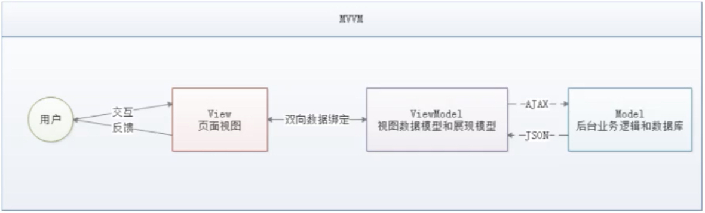
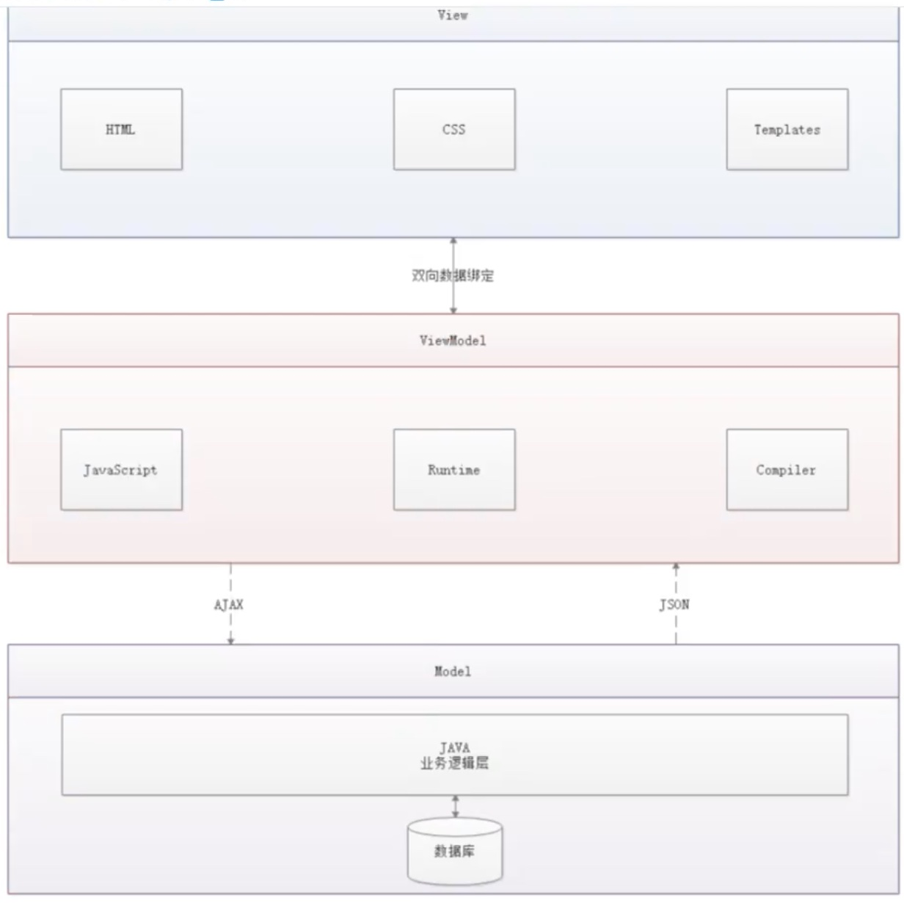

# Vue学习
### MVVM模式

- 什么是MVVM？ - MVVM（Model-View-ViewModel）是一种软件架构设计模式，由微软WPF（用于替代WinForm，以前就是这个技术开发桌面应用程序的）
和Silverlight（类似于Java Applet，简单点说就是在浏览器上运行的WPF）的架构师Ken Cooper和Ted Peters开发，是一种简化用户界面的
**事件驱动编程方式**。由John Gossman（同样也是WPF和Silverlight的架构师）于2005年在他的博客上发表。
- MVVM源自于经典的MVC（Model-View-Controller）模式。MVVM的核心是**ViewModel**层，负责转换Model中的数据对象来让数据变得更容易管理和使用，其作用如下：
    - ModelView层向上与View层进行双向数据绑定
    - ModelView层向下与Model层通过接口请求进行数据交互

PS: Vue不改变DOM元素，双向绑定，前端View数据改动可以通过ViewModel直接反应传递到后端Model，反之亦然。操作DOM影响性能。

MVVM已经相当成熟了，主要运用但不仅仅在网络应用程序开发中。丹霞流行但MVVM框架有Vue.js，AngularJS等
- 为什么要使用MVVM
    - MVVM模式和MVC模式一样，主要目的是分离视图（View）和模型（Model），关注点分离（Separation of concerns，SOC），有以下几大好处：
        - 低耦合：视图（View）可以独立于Model变化和修改，一个ViewModel可以绑定到不同等View上，当View变化当时候Model可以不变，当Model变化的时候View也可以不变。
        - 可复用：你可以把一些视图逻辑放在一个ViewModel里面，让很多View崇勇这段视图逻辑。
        - 独立开发：前端UI开发人员可以专注于业务逻辑和数据的开发（ViewModel），UI设计人员可以专注于页面设计。
        - 可测试：界面速来比较难于测试的，二现在测试可以针对ViewModel来写。
- MVVM的组成部分


#### View
**View**是视图层，也就是用户界面。前端主要由*HTML*和*CSS*来构建，为了更方便地展现*ViewModel*或者*Model*层的数据，已经产生了各种各样的前后端模板语言，
比如FreeMarker、Thymeleaf等等，各大MVVM框架入Vue.js, AngularJS, EJS等也都有自己用来构建用户界面等内置模板语言。
#### Model
**Model**是数据模型，泛指后端进行各种业务逻辑处理和数据操控，主要围绕数据库系统展开。这里等难点主要在于需要和前端约定统一的*接口规则*。
#### ViewModel
**ViewModel**是由前端开发人员组织生成和维护的视图数据层。在这一层，前端开发者对从后端获取的Model数据进行转换处理，做二次封装，以生成符合View层使用预期的视图数据模型。

需要注意的是ViewModel所封装出来的数据模型包括视图的**状态**和**行为**两部分，而Model层的数据模型只包含状态的！
- ViewModel状态：比如页面的这一块展示什么，哪一块展示什么，这些都数据视图状态（展示）
- ViewModel行为：页面加载进来时发生什么，点击这一块发生什么，这一块滚动时发生什么，这些都数据视图行为（交互）

视图状态和行为都封装在了ViewModel里。这样的封装使得ViewModel可以完整地去描述View层。由于实现了双向绑定，ViewModel的内容会实时展示在View层，
这是激动人心的，因为后端开发者再也不必低效又麻烦地通过操纵DOM去更新视图。

MVVM框架已经把最脏最累的一块做好了，我们开发者只需要处理和维护ViewModel，更新数据视图就会自动得到相应更新，真正实现**事件驱动编程**。

View层展现的不是Model层的数据，而是ViewModel的数据，由ViewModel负责与Model层交互，这就完全解耦来View层和Model层，这个解耦是至关重要的，
它是前后端分离方案实施的重要一环。

---
### Vue
Vue是一套用于构建用户界面的渐进式框架，发布于2014年2月。与其它大型框架不同的是，Vue被设计为可以自底向上逐层应用。Vue的核心库只关注视图层，不仅
易于上手，还便于与第三方库（如：vue-router，vue-resource，vuex）或既有项目整合。
#### MVVM模式的实现者
- Model：模型层，在这里表示JavaScript对象
- View：视图层，在这里表示DOM（HTML操作的元素）
- ViewModel：连接视图和数据的中间件，Vue.js就是MVVM中的ViewModel层的实现者

    在MVVM架构中，是不允许数据和视图直接通信的，只能通过ViewModel来通信，而ViewModel就是定义了一个Observer观察者
- ViewModel能够观察到数据的变化，并对视图对应的内容进行更新。
- ViewModel能够监听到视图的变化，并能够通知数据发生改变。

    至此，我们就明白了，Vue.js就是一个MVVM的实现者，她的核心就是实现了DOM舰艇与数据绑定。
#### 为什么要使用Vue.js
- 轻量级，体积小是一个重要指标。Vue.js压缩后只有20多kb（Angular压缩后56kb+，React压缩后44kb+）
- 移动优先。更适合移动端，比如移动端的Touch事件
- 易上手，学习曲线平稳，文档齐全
- 洗去了Angular（模块化）和React（虚拟DOM）的长处，并拥有自己独特的功能，如：计算属性
- 开源，社区活跃度高
- ...

---
### 第一个Vue程序
使用intellij插件：https://plugins.jetbrains.com/plugin/9442-vue-js

#### 下载地址

开发版本
- 包含完整的警告和调试模式：https://vuejs.org/js/vue.js
- 删除了警告，30.96KB min + gzip: https://vuejs.org/js/vue.min.js
    
CDN
```xml
<script src="https://cdn.jsdelivr.net/npm/vue@2.6.14/dist/vue.js"></script>
<script src="https://cdn.jsdelivr.net/npm/vue@2.6.14/dist/vue.min.js"></script>
```` 

#### 代码编写
Vue.js的核心是实现了MVVM模式，她扮演的角色就是ViewModel层，那么所谓的第一个应用程序就是展示她的数据绑定功能，操作流程如下：
1. 创建一个HTML文件demo1.html并测试
2. 引入Vue.js
3. 引入一个Vue的实例
4. 将数据绑定到页面元素

#### 测试
1. 浏览器打开HTML文件
2. 开发者工具Console中输入testvm.message = "update message"，回车后查看页面内容更新成"update message"

由此就可以在控制台来直接修改值，中间是可以省略data的，在这个操作中，我并没有主动操作DOM，就让页面的内容发生了变化，这就是接住了Vue的数据绑定功能
实现的；MVVM模式中要求ViewModel层就是使用观察者模式来实现数据的监听与绑定，以做到数据与视图的快速相应。